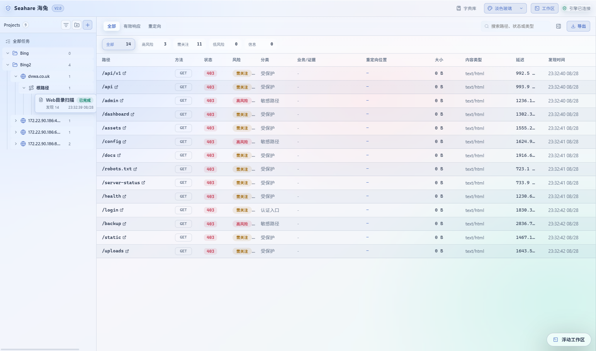
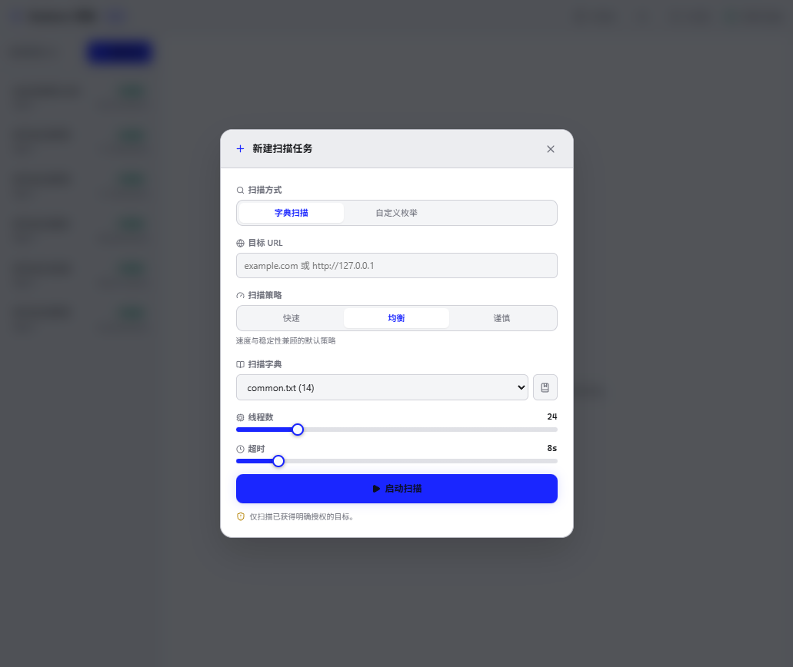
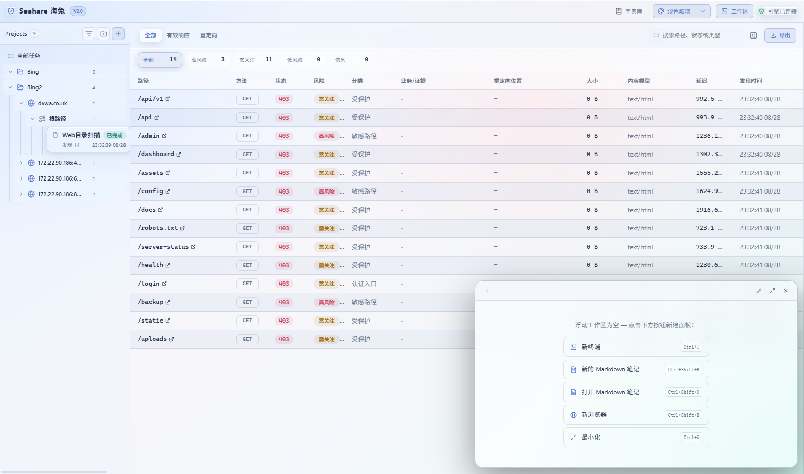

<div align="center">

  

</div>

<h1 align="center">Seahare 海兔</h1>

<p align="center">

  <b>一款前后端分离的 Windows Web 目录扫描工作台</b><br />
  扫描任务 · 实时结果 · 风险分类 · 字典管理 · 内置终端

</p>

<p align="center">

  <a href="#-功能特性">功能特性</a> ·
  <a href="#-快速开始">快速开始</a> ·
  <a href="#-从源码构建">从源码构建</a> ·
  <a href="#-项目结构">项目结构</a> ·
  <a href="#-技术栈">技术栈</a>

</p>

---

> **免责声明：Seahare 仅用于扫描你拥有或已获得明确授权的目标。请遵守当地法律法规，违规使用后果自负。**

## 功能特性


| 特性          | 说明                                            |
| ----------- | --------------------------------------------- |
| **三种扫描策略**  | 快速、均衡、谨慎，支持微调字典、线程数和超时                        |
| **字典 + 枚举** | 支持内置字典扫描和自定义字符集枚举两种模式                         |
| **任务全生命周期** | 启动、暂停、恢复、取消、中断恢复、一键复制重试                       |
| **实时结果流**   | SSE 实时推送，断线自动降级为轮询，不丢数据                       |
| **风险分类**    | 按严重度（高/中/低/信息）与类型归类，实时汇总                      |
| **结果筛选**    | 文本搜索、状态筛选、游标分页、CSV 导出                         |
| **内置终端**    | 基于 xterm.js + node-pty 的 PowerShell 终端，支持色彩高亮 |
| **浮动工作区**   | 可拖动的多标签面板：终端、Markdown 笔记、嵌入式浏览器               |
| **字典管理**    | 内置字典 + 自定义字典创建、导入、删除                          |
| **白天/夜晚主题** | 一键切换，适配不同使用环境                                 |
| **安全保护**    | 记录重定向 Location 作为证据，不自动跟随，避免越界探测              |
| **数据持久化**   | SQLite 存储，异常退出后自动标记中断任务                       |


## 快速开始

### 下载预构建版本

从 [Releases](https://github.com/你的用户名/seahare/releases) 下载最新版本，解压后直接运行 `Seahare.exe` 即可，无需安装任何运行时环境。

### 创建新扫描

<div align="center">

  

</div>

1. 点击左侧 **新建扫描** 按钮
2. 输入目标 URL
3. 选择扫描策略（快速 / 均衡 / 谨慎）
4. 选择字典文件或切换为自定义枚举模式
5. 调整线程数和超时
6. 点击 **启动扫描**

### 查看扫描结果

扫描开始后，结果会实时显示在中间面板。你可以：

- 按风险级别筛选（高 / 中 / 低 / 信息）
- 按响应类型筛选（全部 / 有效响应 / 重定向）
- 搜索路径、状态码或内容类型
- 导出结果为 CSV 文件

### 浮动工作区

<div align="center">

  

</div>

按下 `Ctrl+Alt+A` 打开浮动工作区，支持：


| 快捷键            | 功能             |
| -------------- | -------------- |
| `Ctrl+T`       | 新建终端标签页        |
| `Ctrl+Shift+M` | 新建 Markdown 笔记 |
| `Ctrl+Shift+O` | 打开 Markdown 文件 |
| `Ctrl+Shift+B` | 新建浏览器标签页       |
| `Ctrl+W`       | 最小化浮动工作区       |


## 从源码构建

### 环境要求

- **Python 3.11+**（后端）
- **Node.js 20+**（前端）

### 一键构建

```powershell
powershell -ExecutionPolicy Bypass -File build-windows.ps1
```

构建产物位于 `release/Seahare/Seahare.exe`。

### 分步构建

#### 后端

```powershell
# 安装构建依赖
python -m pip install -r backend/requirements-build.txt

# 构建为独立 EXE
powershell -ExecutionPolicy Bypass -File backend/build.ps1
```

#### 前端

```powershell
cd frontend
npm install
npm run build
npm run package:dir:fallback
```

### 本地开发

```powershell
# 终端 1：启动后端
python -m backend

# 终端 2：启动前端与 Electron
cd frontend
npm install
npm run dev
```

后端默认监听 `http://127.0.0.1:8765`，Electron 会自动检测并连接。

### 运行测试

```powershell
# 后端测试
python -m unittest backend.test_backend -v
python -m py_compile backend/server.py backend/__main__.py

# 前端检查
cd frontend
npm run build
npm run lint
```

## 项目结构

```text
seahare/
├── backend/                    Python 扫描引擎、REST/SSE API、SQLite
│   ├── server.py               核心 HTTP 服务与扫描逻辑
│   ├── __main__.py             启动入口
│   ├── build.ps1               PyInstaller 构建脚本
│   ├── requirements-build.txt  构建依赖
│   ├── test_backend.py         测试套件
│   ├── api.md                  前后端接口契约
│   └── dictionaries/           内置字典文件
├── frontend/                   React + TypeScript 桌面工作台
│   ├── src/                    React 组件和样式
│   │   ├── App.tsx             主应用组件
│   │   ├── FloatingWorkspace.tsx  浮动工作区组件
│   │   └── *.css               样式文件
│   ├── electron/               Electron 主进程
│   │   ├── main.cjs            主进程入口
│   │   ├── preload.cjs         预加载脚本
│   │   ├── pty-helper.cjs      终端 PTY 助手进程
│   │   └── ps-profile.ps1      PowerShell 配置
│   ├── scripts/                打包脚本
│   │   └── package-dir.ps1     自定义目录打包脚本
│   ├── package.json
│   ├── vite.config.ts
│   └── tsconfig*.json
├── build-windows.ps1           Windows 一键构建入口
├── .gitignore
└── README.md
```

## 技术栈


| 层        | 技术                             |
| -------- | ------------------------------ |
| **前端框架** | React 19 + TypeScript 6        |
| **桌面壳**  | Electron 43                    |
| **构建工具** | Vite 8                         |
| **终端**   | xterm.js + node-pty            |
| **后端**   | Python 3.11+（标准库 HTTP 服务）      |
| **数据库**  | SQLite                         |
| **打包**   | PyInstaller + electron-builder |


## 数据存储

运行时数据默认存放在 `%LOCALAPPDATA%\Seahare`：

```
%LOCALAPPDATA%\Seahare\
├── seahare.db         扫描记录与配置
└── dictionaries/      自定义字典文件
```

可通过环境变量 `SEAHARE_DATA_DIR` 覆盖数据目录。

## 许可证

[MIT](LICENSE)

---

